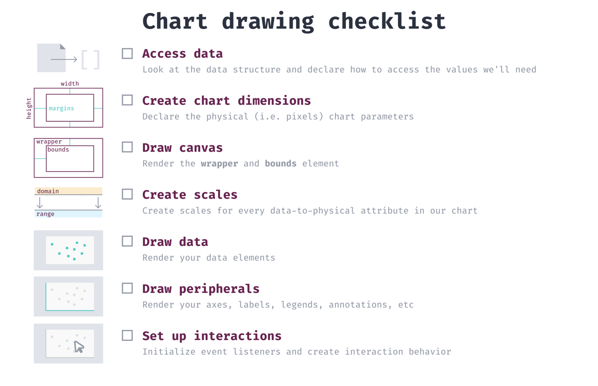
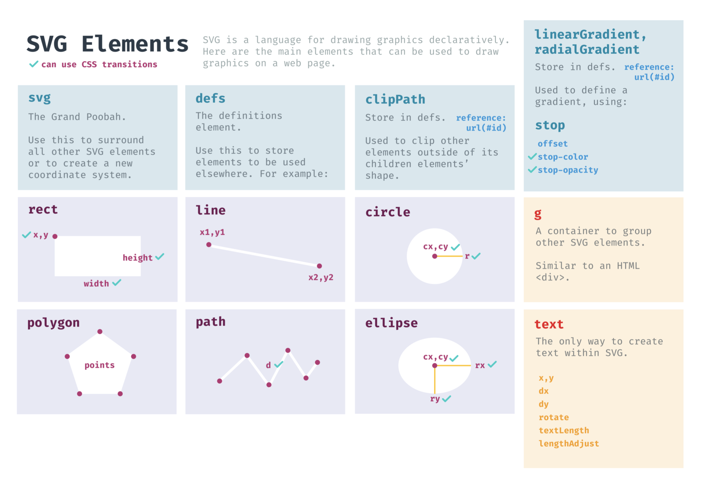

# Data Visualization with D3 

### General steps to take when making a Chart

**1. Access data**

Declare how to access the values we need

**2. Create chart dimensions**

Declare the physical (i.e. pixels) chart parameters

**3. Draw canvas**

Render the chart area and bounds element

**4. Create scales**

Create scales for every data-to-physical attribute in our chart

**5. Draw data**

Render your data elements

**6. Draw peripherals**

Render your axes, labels, and legends

**7. Set up interactions**

Initialize event listeners and create interaction behavior

